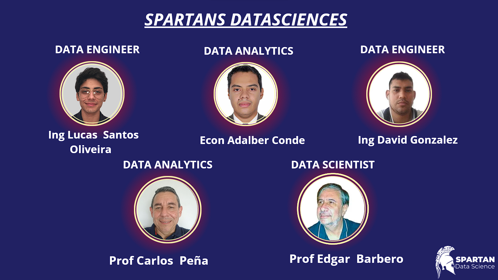
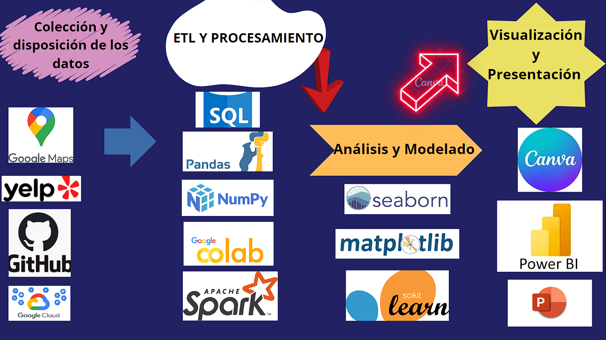
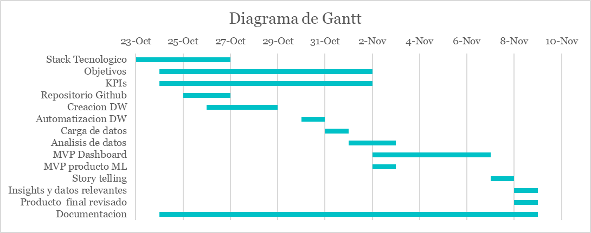

<h1> Proyecto: RestoTrends </h1>

 

## **Tabla de contenidos**
- [¿Quienes Somos?](#Quienes-Somos)
- [Nuestro Equipo](#Nuestro-Equipo)
- [Descripción del Proyecto](#Descripción-del-proyecto)
- [Objetivos](#Objetivos)
- [Alcance](#Alcance)
- [Stack Tecnológico](#Stack-Tecnológico)
- [Metodología de Trabajo](#Metodología-de-Trabajo)
- [Diagrama de  Gantt](#Diagrama-de-Gantt)

## **Quienes Somos**

Somos **Spartan Data Science**, un equipo  de profesionales dinámico y creativo, con la capacidad de entender las  necesidades de los  clientes y transformar  sus requerimientos en soluciones  agiles y pertinentes para el  mejoramiento  continuo de  las  empresas. 

Nos destacamos por dar la respuesta adecuada  y oportuna  a  las  inquietudes de empresarios e inversores para  la  toma de deciciones informada y con el sustento pertinente.
 

## **Nuestro Equipo**

## **Descripción del Proyecto**

En nuestra calidad de especialistas en análisis de datos, examinamos minuciosamente la información recopilada en sitios de reseñas como Yelp y Google Maps con el propósito de identificar patrones y tendencias provenientes de los comentarios de los usuarios para entender profundamente sus experiencias, necesidades y expectativas respecto a diversos servicios y negocios. Este ejercicio de evaluación de datos nos permite ofrecer consejos y sugerencias detalladas tanto a potenciales inversores interesados en este proyecto, como a empresarios existentes, siendo un recurso crucial para la toma de decisiones informadas y la mejora de la reputación y la percepción de los negocios en la mente de los clientes. Este propósito se logra mediante la implementación de métodos sofisticados de análisis de sentimientos y aprendizaje automático para ofrecer a nuestros clientes un sistema de recomendaciones eficaz y fácil de usar, así como información valiosa relacionada con tendencias y sentimientos de consumidores para la toma de decisiones informada por parte de inversionistas. 
 

## **Objetivos**

Desarrollar una plataforma comprensiva que se encargue de reunir, limpiar y presentar datos organizados y claros de comentarios de usuarios. Esto se logra mediante la realización de un análisis exploratorio, la creación de un sistema de recomendaciones fundamentado en el análisis de sentimientos, un modelo predictivo para evaluar el crecimiento empresarial y un panel interactivo para la visualización y exploración detallada de los resultados.
 

## **Alcance**

Realizar un desarrollo inicial a nivel local con solo una muestra de los datos disponibles con el propósito de desarrollar las funcionalidades necesarias y poder disponibilizar el producto final en un sistema en la nube que pueda manejar la totalidad de los datos en una etapa posterior.  De la misma forma se construirá un tablero interactivo que pueda manejar cualquier tamaño de datos y genere la información relevante que finalmente va a consumir el cliente final
 

## **Stack Tecnológico**

 

## **Metodología de trabajo**

Utilizaremos un método de trabajo ágil con enfoque en la metodología SCRUM, en donde dividiremos y asignaremos las actividades a realizar, guiados por un diagrama de Gantt y manteniendo un seguimiento durante todas las etapas del proyecto.

## **Diagrama de Gantt**

 

## **Información y Recursos**

### Documento Dossier del Proyecto

Al hacer <a href="https://github.com/SantosOliveiraLucas/PF_Google_Yelp/blob/main/PROYECTO.pdf">click en este enlace</a> será conducido al documento que proporciona recursos, detalle, metodología, resultados esperados, entre otros detalles explicados con mayor precisión.

### Documentación de Sprint y Avances del Proyecto 

Al hacer <a href="https://github.com/SantosOliveiraLucas/PF_Google_Yelp/blob/main/Sprint1.pdf">click en este enlace</a> será conducido al documento perteneciente al Sprint 1.

### Datos del Proyecto

Al hacer <a href="https://github.com/SantosOliveiraLucas/PF_Google_Yelp/tree/main/data">click en este enlace</a> será conducido a la carpeta que contiene los conjuntos de datos utilizados en el proyecto, lo que te permitirá acceder y explorar los datos subyacentes.

 

### Notebooks de ETL

Al hacer <a href="https://github.com/SantosOliveiraLucas/PF_Google_Yelp/tree/main/ETLs">click en este enlace</a> será conducido a la carpeta que contiene los Notebooks del proceso de Extracción, Transformación y Carga (ETL) de datos.

 

### Diccionario de tablas

Al hacer [click en el siguiente enlace](https://github.com/Hotcer/Spartans-Project/blob/master/Diccionario.md) será conducido al archivo donde se encuentra el diccionario de las tablas que usamos.

### Notebooks de EDA

Al hacer <a href="https://github.com/SantosOliveiraLucas/PF_Google_Yelp/tree/main/EDAs">click en este enlace</a> será conducido a la carpeta que contiene los Notebooks del proceso de análisis exploratorio de datos (EDA).

### Video representativo de nuestra Automatización

Al hacer [click en este enlace](https://drive.google.com/file/d/1lrnQAMO9Aa_GPigfIoAYQdb_JjyEDBwJ/view?usp=sharing) será conducido a un drive que contiene el video de la representación del trabajo de nuestra VM. Esta esta representa de manera más visual cuál es el trabajo de nuestro preograma para la actualización automatica de nuestros datos.

#### Archivos complementarios a la automatización
Al hacer [click en este enlace](https://drive.google.com/drive/folders/1GhR8QvGcFZlOCL4ugEFCfyQNQ1GmjHE-?usp=drive_link) será conducido a un drive que contiene toda una carpeta que almacena distintos archivos que hacen que nuestra VM funcionen. También cuenta con un archivo que cuenta un poco más acerca del proceso.
